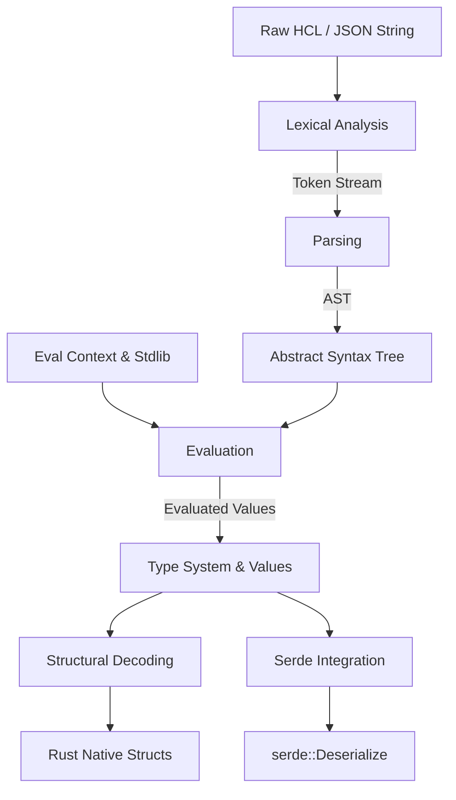

# Architecture of `hcl-rs`

This document describes the high-level architecture and subsystem interactions within the `hashicorp-configuration-language-rs` crate. The crate is designed as a direct Rust-native analog to the official Go implementation (`hashicorp/hcl` and `zclconf/go-cty`).

## Core Subsystems

The library is divided into several distinct phases of execution:
1. **Lexical Analysis (`src/lex/`)**
2. **Parsing (`src/parse/`)**
3. **Abstract Syntax Tree (`src/ast/`)**
4. **Type System & Values (`src/types/`)**
5. **Context & Evaluation (`src/eval/`)**
6. **Structural Decoding (`src/decode.rs`, `hcl-macros`)**
7. **Serde Integration (`src/serde/`)**

---

### 1. Lexical Analysis (`lex`)
The lexer transforms a raw UTF-8 string into a stream of strongly-typed `Token`s. It handles:
- **Comments**: Single-line (`#`, `//`) and multi-line (`/* ... */`).
- **Identifiers**: Compliant with Unicode Standard Annex #31 (UAX #31).
- **Strings & Heredocs**: Advanced handling of standard (`<<EOF`) and indented (`<<-EOF`) heredocs, stripping leading indents correctly.
- **Spans**: Every token tracks its exact start/end byte, line, and column, which is critical for emitting rich `Diagnostics`.

### 2. Parsing (`parse`)
The parser consumes the token stream and generates the Abstract Syntax Tree (AST).
- **Structural Parsing**: Resolves the outer `Body`, determining `Attributes` (e.g., `key = "value"`) and `Blocks` (e.g., `resource "aws_instance" "web" { ... }`).
- **Expression Parsing**: Utilizes a Pratt (precedence) parser for handling complex HCL2 expressions, including mathematical operations, binary logic, conditionals (`a ? b : c`), and function calls.
- **JSON Profile Standard**: Native capability to ingest `.json` strings and map them accurately onto the HCL AST.

### 3. Abstract Syntax Tree (`ast`)
The AST strictly defines the language constructs.
- **`Body`**: Contains a collection of blocks and attributes.
- **`Expression`**: Recursive enum covering literal types, tuple/object constructors, string templates (interpolations and directives like `%{ if }`), `ForExpr`, `SplatExpr`, etc.

### 4. Type System & Values (`types`)
This module replicates HashiCorp's `go-cty`.
- **`Type`**: Enums for primitive (`String`, `Number`, `Bool`) and complex (`List`, `Set`, `Map`, `Object`, `Tuple`) types.
- **`Value`**: Ties data to a specific `Type`. Handles `Value::Unknown` (crucial for Terraform/Packer `plan` outputs where a value won't be known until apply time) and `Value::Null(Type)`.
- **Unification**: Contains strict coercion rules (e.g., Tuple to List, Object to Map, String to Number).

### 5. Context & Evaluation (`eval`)
The evaluator reduces AST `Expression` nodes into concrete `Value` instances.
- **`Context`**: Holds scoped variables and function definitions. Scopes can be hierarchically nested.
- **`Evaluator`**: Walks the AST using a context. Implements short-circuiting for logical operators (`&&`, `||`) and safely cascades `Value::Unknown` through mathematical and logical operations.
- **`stdlib`**: Contains a complete implementation of HCL's native standard library (e.g., `upper()`, `cidrsubnet()`, `jsonencode()`).

### 6. Structural Decoding (`decode`, `hcl-macros`)
Replicates the functionality of `gohcl` in Go.
- **`DecodeBody` & `DecodeValue`**: Traits defining how AST nodes and evaluated `Value`s map to native Rust types.
- **`#[derive(DecodeBody)]`**: A procedural macro that automatically generates the mapping boilerplate for Rust structs. It extracts attributes from an evaluated AST `Body` and maps them directly, collecting multiple errors into `Diagnostics`.

### 7. Serde Integration (`serde`)
Allows users to treat HCL identically to JSON, YAML, or TOML using the `serde` ecosystem.
- **Deserialization (`de.rs`)**: Parses HCL strings, converts the structure into an intermediate JSON-equivalent structure, and uses `serde_json::from_value` to map to `T: DeserializeOwned`.
- **Serialization (`ser.rs`)**: Takes a `T: Serialize`, converts it to a JSON value, and outputs formatted HCL logic via a recursive formatting engine.

---

## Error Handling & Diagnostics

We strictly avoid the use of `unwrap()`, `expect()`, or string-based errors (e.g., `anyhow`).
All errors are reported via a `Diagnostics` collection. A single `Diagnostic` contains:
- **Severity**: Error or Warning.
- **Summary**: High-level description.
- **Detail**: In-depth explanation.
- **Subject**: The `Span` indicating the exact byte/line range where the error occurred.

This allows the parser and evaluator to recover from partial failures, accumulating multiple errors to show the user in a single pass.
