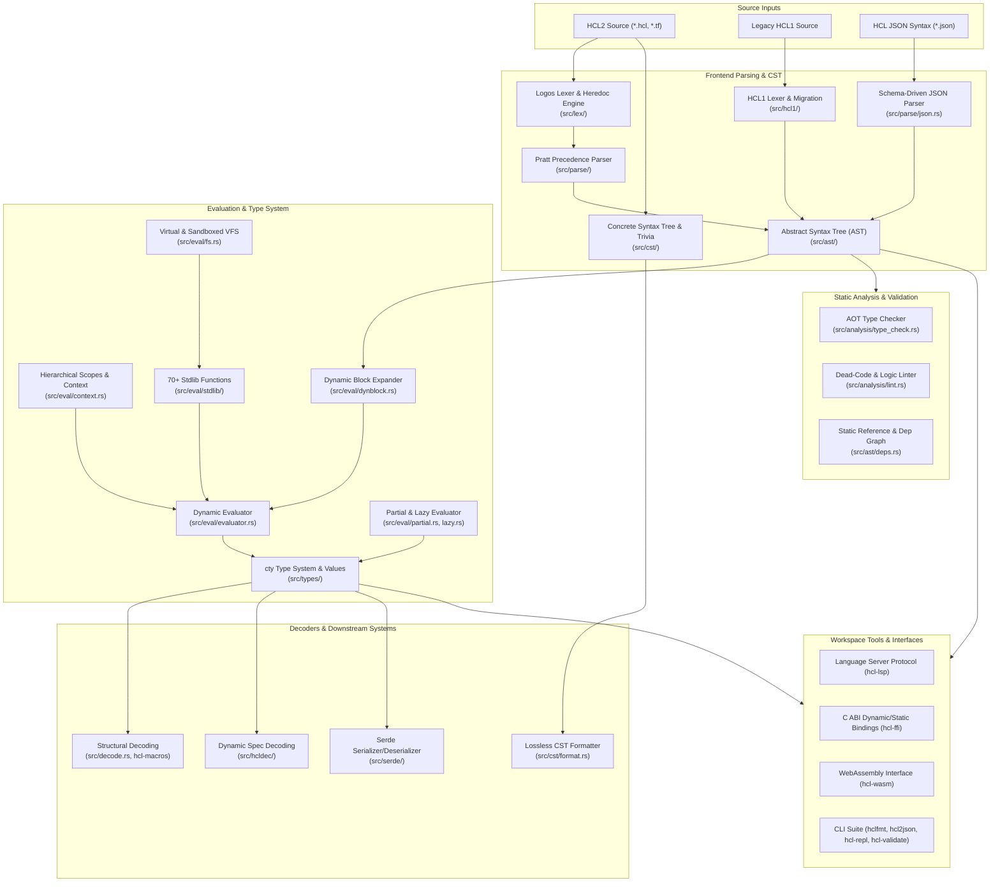

# Architecture of `hashicorp-configuration-language-rs`

This document details the internal systems, data structures, execution pipelines, and design invariants of `hashicorp-configuration-language-rs`. The crate is designed as an industrial-strength, spec-compliant, 100% native Rust implementation of the HashiCorp Configuration Language (HCL2) and HashiCorp's `cty` type system, delivering semantic parity with the official Go implementations (`hashicorp/hcl/v2`, `zclconf/go-cty`, and `hashicorp/hcl-lang`).

---

## 1. System Pipeline

---

## 2. Core Subsystems

### 2.1 Lexical Analysis (`src/lex/`)
The lexer converts raw UTF-8 streams into strongly-typed `Token` instances using [Logos](https://github.com/maciejhirsz/logos).
- **Identifier Compliance**: Identifiers follow Unicode Standard Annex #31 (UAX #31) rules, supporting namespaced and scoped identifiers (`foo::bar`).
- **Heredocs**: Handles standard (`<<EOF`) and indented (`<<-EOF`) heredocs. Indented heredocs determine minimum indentation prefixes across non-empty lines and strip them losslessly while preserving relative indentations.
- **Escape Sequences & Interpolations**: Disambiguates escaped delimiters (`$${`, `%%{`), template interpolations (`${...}`), and directives (`%{if...}`, `%{for...}`), supporting whitespace trim markers (`~`).
- **Span Tracking**: Every token encapsulates a `Span` with byte start/end positions and 1-based line and column offsets.

### 2.2 Concrete Syntax Tree & Splicing (`src/cst/`)
Unlike an AST that discards trivia, the CST preserves 100% of the lexical structure:
- **`Document` & `TokenStream`**: Represents the raw token sequence, retaining leading/trailing newlines, spaces, and comments (`#`, `//`, `/* ... */`).
- **In-Place Mutation & Splicing (`src/cst/splicing.rs`)**: Enables structural editing of attributes, block labels, and expressions while retaining original whitespace, comments, and delimiters.
- **Canonical Formatter (`src/cst/format.rs`)**: Implements `hclwrite` formatting parity, calculating column alignment for contiguous assignment operators (`=`), normalizing indentation, and compacting trivia upon node deletion.

### 2.3 Abstract Syntax Tree & Parsing (`src/ast/`, `src/parse/`)
The parsing pipeline uses a recursive descent parser for high-level structure coupled with a Pratt parser for expressions:
- **Structural Parser**: Parses top-level and nested `Body` elements into `Block` and `Attribute` nodes. Resolves multi-label blocks and validation/assertion blocks (`precondition`, `postcondition`, `validation`).
- **Pratt Precedence Parser**: Correctly resolves unary and binary operators (arithmetic, equality, comparison, logical conjunction/disjunction) and ternary conditionals (`cond ? true_val : false_val`).
- **Comprehensions & Splats**: Supports tuple/object for-expressions (`[for k, v in list : expr if cond]`) and splat traversals (`attr.*.id` and `attr[*].id`).
- **Visitor & Transformation Patterns (`src/ast/walk.rs`)**: Provides `AstVisitor` (read-only traversal) and `AstFolder` (tree-rewriting) traits.
- **Static Dependency Analysis (`src/ast/deps.rs`)**: Extracts static references from expressions and bodies, building an acyclic `DependencyGraph` with topological sorting.

### 2.4 HashiCorp `cty` Type System (`src/types/`)
A pure Rust realization of HashiCorp's `go-cty` type algebra:
- **Type Hierarchy (`ty.rs`)**:
  - *Primitives*: `String`, `Number` (arbitrary-precision decimal powered by `BigDecimal`), `Bool`.
  - *Collections*: `List(T)`, `Set(T)`, `Map(T)`.
  - *Structural*: `Tuple(Vec<T>)`, `Object(BTreeMap<String, T>)`.
  - *Dynamic*: `DynamicPseudoType` for unconstrained parameters or multi-type slots.
  - *Capsule*: Encapsulates arbitrary foreign Rust types (`Arc<dyn Any>`) with custom arithmetic, comparison, and index hooks.
- **Unknown Value Semantics (`Value::Unknown`)**: Critical for Terraform-style planning phases. Unknown values propagate cleanly through expressions, function calls, and collection operations without causing panics or unrecoverable evaluation errors.
- **Null Values (`Value::Null(Type)`)**: Type-tagged nulls conforming to HCL2 specification semantics.
- **Unification & Coercion (`unify.rs`)**: Deterministic type coercion (e.g. converting Tuples to lowest-common-denominator Lists, Objects to Maps, or Numbers to Strings).
- **Value Mark Tracking (`val.rs`)**: Granular, path-indexed sensitivity marks (`Value::mark_path`, `Value::unmark_path`) allowing specific nested keys to be marked sensitive while preserving container traversals.
- **Wire Formats (`json.rs`, `msgpack.rs`)**: Native encoding and decoding of `cty` types and values to/from JSON and MessagePack schemas.

### 2.5 Evaluator & Scopes (`src/eval/`)
- **Evaluation Context (`context.rs`)**: Scopes form a parent/child hierarchy where lookups ascend the tree while variable mutations remain local.
- **Dynamic Blocks (`dynblock.rs`)**: Evaluates `dynamic "type" { for_each = ... content { ... } }` blocks, expanding them into multiple concrete blocks prior to structural decoding.
- **Lazy Evaluation & Memoization (`lazy.rs`)**: Defers parsing and evaluating attributes until explicitly requested, caching evaluated results to avoid redundant calculations.
- **Partial Evaluation (`partial.rs`)**: Evaluates known branches while preserving AST representations for unknown variables, enabling multi-stage planning pipelines.
- **Virtual Filesystems (`fs.rs`)**: Provides `MemFileSystem`, `ArchiveFileSystem` (supporting `.zip`, `.tar`, and `.tar.gz`), and `SandboxedFileSystem` (preventing directory traversal attacks).
- **Native Standard Library (`stdlib/`)**: Exhaustive implementation of over 70 standard functions mirroring official HCL behavior:
  - *String*: `format`, `join`, `split`, `upper`, `lower`, `replace`, `trim`, `regex`, `regexall`, `substr`, `indent`, `chomp`, `title`.
  - *Numeric*: `abs`, `ceil`, `floor`, `log`, `max`, `min`, `parseint`, `pow`, `signum`.
  - *Collection*: `concat`, `contains`, `distinct`, `element`, `flatten`, `index`, `keys`, `lookup`, `merge`, `reverse`, `slice`, `sort`, `values`, `zipmap`.
  - *Encoding*: `base64encode`, `base64decode`, `base64gzip`, `csvdecode`, `jsonencode`, `jsondecode`, `urlencode`, `yamlencode`, `yamldecode`.
  - *Date & Time*: `formatdate`, `timeadd`, `timestamp`, `plantimestamp`.
  - *Crypto*: `bcrypt`, `md5`, `sha1`, `sha256`, `sha512`, `uuidv4`, `uuidv5`, `rsadecrypt`.
  - *Network*: `cidrhost`, `cidrnetmask`, `cidrsubnet`, `cidrsubnets`.
  - *Filesystem*: `abspath`, `dirname`, `pathexpand`, `basename`, `file`, `fileexists`, `filebase64`, `filemd5`, `filesha256`, `fileset`, `templatefile`.
  - *Conversion*: `tobool`, `tolist`, `tomap`, `tonumber`, `toset`, `tostring`, `can`, `try`.

### 2.6 Structural Decoding (`src/decode.rs`, `hcl-macros`)
Equivalent to HashiCorp's `gohcl` library:
- **`DecodeBody` & `DecodeValue` Traits**: Define bidirectional mapping from AST nodes and evaluated `cty.Value`s into native Rust structures.
- **Procedural Macros (`hcl-macros`)**:
  - `#[derive(DecodeBody)]`: Automatically maps attributes, labels, and blocks into struct fields.
  - `#[hcl(block)]`: Maps blocks to child structs, `Vec<T>`, or label-keyed maps (`HashMap<String, T>`, `BTreeMap<String, T>`).
  - `#[hcl(flatten)]` / `#[hcl(squash)]`: Inlines child fields into the parent body scope.
  - `#[hcl(body)]`: Retains the raw, unevaluated `Body` for downstream inspection.
  - `#[hcl(with = "...")]`: Custom decoding hook invocation.
  - `#[derive(EncodeBody)]`: Re-encodes native structs back into formatted CST bodies.

### 2.7 Specification-Driven Decoding (`src/hcldec/`)
Provides runtime-configurable schema definitions matching Go's `hcldec`:
- **`Spec` Hierarchy**: `BlockSpec`, `AttrSpec`, `BlockListSpec`, `BlockMapSpec`, `BlockSetSpec`, `TupleSpec`, `TransformSpec`, and `DefaultSpec`.
- **Validation**: Enforces type constraints, regex patterns, value ranges, and custom validation closures without requiring compile-time Rust structs.
- **Multi-Stage Partial Decoding**: Partially decodes bodies against specifications when some dependencies are unknown.

### 2.8 Legacy HCL 1.0 Compatibility (`src/hcl1/`)
- Dedicated tokenizer (`lex.rs`) and recursive-descent parser (`parser.rs`) supporting legacy HCL 1.0 syntax.
- Migration engine (`migrate.rs`) transforming HCL1 ASTs into canonical HCL2 ASTs, automatically converting legacy quoted interpolation syntax (`"${...}"`) into native HCL2 expressions.

### 2.9 Static Analysis & Linter (`src/analysis/`)
- **`TypeChecker`**: Performs Ahead-of-Time (AOT) type checking of AST bodies against a `ScopeSchema`, validating expressions, function signatures, and traversals without runtime values.
- **`Linter`**: Detects dead code, unused local variables, tautological conditionals (`true ? a : b`), unreachable template directives, and redundant type conversions.

### 2.10 Diagnostic Architecture (`src/diagnostic/`)
- **Centralized Aggregation**: All failure paths return a `Diagnostics` container that accumulates multiple errors and warnings in a single pass.
- **Source Spans**: Retains exact line, column, and byte bounds with context snippets.
- **Damerau-Levenshtein Typo Suggestions**: Suggests closest valid attribute or variable names when an unknown identifier is encountered.
- **Formatters**: Pretty terminal formatting with ANSI color support, plus standardized JSON diagnostic output conforming to HashiCorp's JSON diagnostic schema.

---

## 3. Workspace Ecosystem & Extensions

| Crate | Role | Architectural Mechanics |
| :--- | :--- | :--- |
| **`hcl-macros`** | Macro Expansion | Implements `DecodeBody`, `EncodeBody`, `DecodeValue`, `EncodeValue`, and `ImpliedBodySchema` proc-macros. |
| **`hcl-lsp`** | Language Server | Multi-threaded JSON-RPC LSP daemon (stdio/TCP) implementing hover, definitions, document symbols, completions, and semantic token highlighting. |
| **`hcl-ffi`** | C ABI Bindings | Exposes opaque pointer handles (`hcl_body_t`, `hcl_context_t`, `hcl_value_t`) and a C header (`include/hcl.h`) for embedding in C, C++, Python, or Go. |
| **`hcl-wasm`** | WebAssembly | Compiles to `wasm32-unknown-unknown` via `wasm-bindgen`, exposing JavaScript APIs and TypeScript type declarations (`hcl.d.ts`). |
| **`fuzz`** | Continuous Fuzzing | Target-driven fuzzing harnesses (`parse`, `eval`, `msgpack`, `hcl1`) driven by `libFuzzer` and `cargo-fuzz`. |

---

## 4. Engineering Invariants

1. **Zero-Panic Policy**: `#![deny(clippy::unwrap_used, clippy::expect_used, clippy::panic)]` is strictly enforced across all non-test code. All fallible paths return typed `Result<T, Diagnostics>` or `Result<T, HclError>`.
2. **Unified Error Hierarchy**: Error representations are strongly typed via `HclError` using `derive_more`, completely rejecting `anyhow` or unstructured string errors.
3. **100% Documentation Coverage**: Enforced via `#![deny(missing_docs)]` on every module, struct, enum variant, field, trait, and function.
4. **Deterministic Evaluation**: Floating-point parsing and arithmetic rely on arbitrary-precision decimals (`BigDecimal`) to prevent rounding errors across environments.
