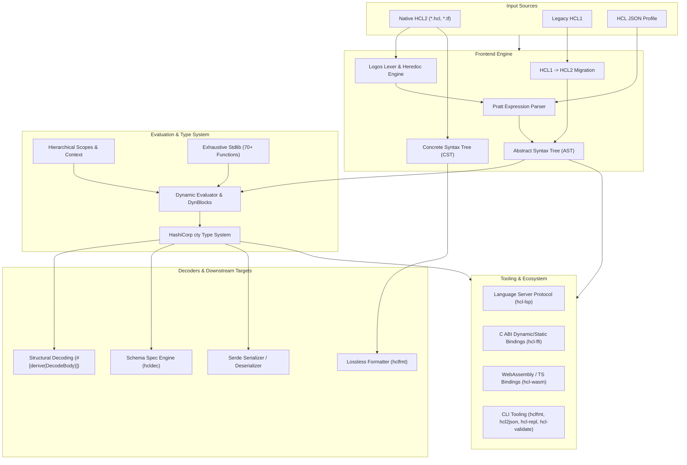

hashicorp-configuration-language-rs
===================================

[](https://opensource.org/licenses/Apache-2.0)
[](https://github.com/SamuelMarks/hashicorp-configuration-language-rs/actions/workflows/ci.yml)


A production-grade, spec-compliant, 100% native Rust implementation of the **HashiCorp Configuration Language (HCL2)** and the **`cty` type system**.

Designed as the core configuration engine for infrastructure-as-code platforms, cloud orchestration tooling, and compilers—such as [`stamp`](https://github.com/SamuelMarks/stamp) (a Packer analog) and [`migratory`](https://github.com/SamuelMarks/migratory) (a Vagrant analog)—this workspace provides complete behavioral and semantic parity with the original [HashiCorp HCL](https://github.com/hashicorp/hcl) project ([`hashicorp/hcl`](https://github.com/hashicorp/hcl) and [`zclconf/go-cty`](https://github.com/zclconf/go-cty)).

Following HashiCorp's transition of its core software ecosystem from open-source licensing (Mozilla Public License v2.0) to the Business Source License (BSL v1.1) in August 2023 [^bsl], this workspace provides an independent, clean-room, and permissively licensed (CC0 / Apache-2.0 / MIT) native Rust implementation, guaranteeing long-term open-source availability and community continuity.

---

## Architectural Overview



---

## Key Features

### 1. Robust Lexing & Pratt Expression Parsing
- **Logos-Powered Tokenizer**: High-throughput tokenization tracking precise byte offsets, line numbers, and column offsets.
- **Unicode Identifiers**: Strict adherence to Unicode Standard Annex #31 (UAX #31) identifier syntax.
- **Heredoc Engine**: Full support for standard (`<<EOF`) and indented (`<<-EOF`) heredocs with automatic indentation trimming.
- **Pratt Precedence Parser**: Correct operator precedence and associativity across binary arithmetic, unary operators, logical conjunctions/disjunctions, and ternary conditionals (`cond ? true_val : false_val`).
- **Template Engine**: Native template expressions including string interpolation (`${...}`), conditionals (`%{if ...} ... %{else} ... %{endif}`), and iteration directives (`%{for ... in ...} ... %{endfor}`), including whitespace strip markers (`~`).

### 2. Concrete Syntax Tree (CST) & Lossless Formatting
- **Trivia Preservation**: Preserves all whitespace, comments (`#`, `//`, `/* ... */`), and formatting trivia.
- **Programmatic AST Splicing**: Safely modify, insert, or redact attributes without destroying surrounding indentation or comments.
- **Canonical Code Formatter (`hclfmt`)**: Re-indents blocks, aligns assignment operators (`=`), and standardizes spacing.

### 3. HashiCorp `cty` Type Algebra
- **Comprehensive Primitive & Structural Types**: Complete implementation of `cty` types (`String`, `Number` with arbitrary precision, `Bool`, `List`, `Set`, `Map`, `Object`, `Tuple`, and `DynamicPseudoType`).
- **Unknown Value Semantics (`Value::Unknown`)**: Essential for "plan" phases where values are unresolved until execution time; unknown values propagate through expressions without crashing.
- **Null Value Semantics (`Value::Null`)**: Type-tagged nulls conforming to HCL2 specification rules.
- **Type Coercion & Unification**: Automatic conversions and lowest-common-supertype unification across collections, tuples, and structural objects.
- **Wire Formats**: Bidirectional serialization of `cty` types and values to and from both **JSON** and **MessagePack**.

### 4. Evaluator, Scoping & Dynamic Blocks
- **Hierarchical Lexical Scopes**: Parent/child scoping for lexical evaluation contexts.
- **Dynamic Block Expansion**: Evaluates `dynamic "block_type" { for_each = ... content { ... } }` structures before structural decoding.
- **Splat Expressions**: Full support for attribute-only splats (`var.list.*.id`) and full splats (`var.list[*].id`).
- **For Expressions**: Collection comprehensions with filtering (`[for k, v in obj : upper(v) if k != "skip"]`).
- **Partial Evaluation**: Evaluates all known expressions while leaving unknown or missing variables intact for multi-phase workflows.

### 5. Exhaustive Standard Library (70+ Functions)
Built-in native functions matching official HCL behavior across all categories:
- **String**: `format`, `join`, `split`, `upper`, `lower`, `replace`, `trim`, `trimspace`, `trimprefix`, `trimsuffix`, `regex`, `regexall`, `substr`, `strlen`, `strrev`, `indent`, `chomp`, `title`.
- **Numeric**: `abs`, `ceil`, `floor`, `log`, `max`, `min`, `parseint`, `pow`, `signum`.
- **Collection**: `alltrue`, `anytrue`, `chunklist`, `coalesce`, `coalescelist`, `compact`, `concat`, `contains`, `distinct`, `element`, `flatten`, `index`, `keys`, `lookup`, `merge`, `one`, `reverse`, `setintersection`, `setproduct`, `setsubtract`, `setunion`, `slice`, `sort`, `sum`, `transpose`, `values`, `zipmap`.
- **Encoding**: `base64encode`, `base64decode`, `base64gzip`, `csvdecode`, `jsonencode`, `jsondecode`, `urlencode`, `yamlencode`, `yamldecode`.
- **Date & Time**: `formatdate`, `timeadd`, `timestamp`, `plantimestamp`.
- **Cryptography**: `bcrypt`, `md5`, `sha1`, `sha256`, `sha512`, `uuidv4`, `uuidv5`, `rsadecrypt`.
- **IP Network**: `cidrhost`, `cidrnetmask`, `cidrsubnet`, `cidrsubnets`.
- **Filesystem**: `abspath`, `dirname`, `pathexpand`, `basename`, `file`, `fileexists`, `filebase64`, `filebase64sha256`, `filebase64sha512`, `filemd5`, `filesha1`, `filesha256`, `filesha512`, `fileset`, `templatefile`.
- **Type Conversion**: `tobool`, `tolist`, `tomap`, `tonumber`, `toset`, `tostring`, `can`, `try`.

### 6. Macro-Driven Structural Decoding (`gohcl` Parity)
- Procedural derive macro `#[derive(DecodeBody)]` maps evaluated HCL blocks and attributes directly to native Rust structs.
- Supports nested blocks, optional fields, default attributes, label decoding, and multi-error diagnostic aggregation.

### 7. Spec-Driven Decoding (`hcldec`)
- Declarative schema specifications (`BlockSpec`, `AttrSpec`, `BlockListSpec`, `BlockMapSpec`) allow dynamic validation and decoding without predefined compile-time types.

### 8. HCL 1.0 Compatibility & Migration
- Includes a dedicated HCL 1.0 lexer and parser, with an automated migration subsystem to rewrite legacy HCL1 configurations into modern HCL2.

### 9. Static Analysis & Linting
- AST visitor and folder traits (`AstVisitor`, `AstFolder`).
- Dependency graph generation and static reference extraction (`extract_static_references`).
- Static type checker and configurable linter rules (`Linter`, `TypeChecker`).

### 10. Compiler-Grade Diagnostics
- Rich diagnostics with `Severity::Error` and `Severity::Warning`.
- Exact source code `Span` highlights with line, column, and byte tracking.
- Contextual suggestions, label recommendations, pretty terminal rendering, and structured JSON output.

---

## Workspace Ecosystem

| Crate / Directory | Description |
| :--- | :--- |
| **`hashicorp-configuration-language-rs`** | Core engine: lexer, parser, AST, CST, cty types, evaluator, stdlib, decoders, and CLI binaries. |
| **`hcl-macros`** | Procedural derive macros: `#[derive(DecodeBody)]` and `#[derive(EncodeBody)]`. |
| **`hcl-lsp`** | Language Server Protocol (LSP) daemon featuring hover, definitions, symbol search, completions, and semantic highlighting. |
| **`hcl-ffi`** | C-compatible FFI bindings and C header file (`include/hcl.h`) for embedding in C, C++, Python, or Go. |
| **`hcl-wasm`** | WebAssembly package with TypeScript declarations (`hcl.d.ts`) for browser and Node.js runtimes. |
| **`fuzz`** | Continuous fuzzing targets (`parse`, `eval`, `msgpack`, `hcl1`) via `cargo-fuzz` and `libFuzzer`. |

---

## CLI Tools

The root crate builds several standalone command-line utilities:

```bash
# Canonical HCL code formatter
cargo run --bin hclfmt -- [OPTIONS] <PATH...>

# High-performance HCL to JSON converter
cargo run --bin hcl2json -- [OPTIONS] <FILE>

# Interactive expression evaluation REPL
cargo run --bin hcl-repl

# Configuration and schema validator
cargo run --bin hcl-validate -- <FILE>

# Parity test runner against reference Go implementations
cargo run --bin grounding
```

---

## Quick Start & Examples

### 1. High-Level Struct Decoding (`DecodeBody`)

The recommended, idiomatic way to parse and decode HCL into strongly typed Rust structs:

```rust
use hashicorp_configuration_language_rs::api::from_str;
use hcl_macros::DecodeBody;

#[derive(DecodeBody, Debug, PartialEq)]
struct ServerConfig {
    host: String,
    port: i64,
    tags: Vec<String>,
    enabled: bool,
}

fn main() {
    let input = r#"
        host    = "127.0.0.1"
        port    = 8080
        tags    = ["api", "v2"]
        enabled = true
    "#;

    match from_str::<ServerConfig>(input) {
        Ok(config) => println!("Decoded configuration: {:#?}", config),
        Err(diags) => {
            for err in diags.errors() {
                eprintln!("Error: {} at {:?}", err.summary, err.subject);
            }
        }
    }
}
```

---

### 2. Evaluation with Variables and Standard Library Functions

Inject dynamic variables and evaluate expressions utilizing the built-in standard library:

```rust
use hashicorp_configuration_language_rs::api::from_str_with_context;
use hashicorp_configuration_language_rs::eval::context::Context;
use hashicorp_configuration_language_rs::types::ty::Type;
use hashicorp_configuration_language_rs::types::val::{Value, ValueData};
use hcl_macros::DecodeBody;

#[derive(DecodeBody, Debug)]
struct ClusterConfig {
    cluster_id: String,
    node_count: i64,
    cidr_block: String,
}

fn main() -> Result<(), Box<dyn std::error::Error>> {
    let input = r#"
        cluster_id = upper("${env_name}-primary")
        node_count = min(10, base_nodes * 2)
        cidr_block = cidrsubnet("10.0.0.0/16", 8, 2)
    "#;

    let mut ctx = Context::with_stdlib();
    ctx.set_variable("env_name", Value::new(Type::String, ValueData::String("production".into())));
    ctx.set_variable("base_nodes", Value::new(Type::Number, ValueData::Number(4.into())));

    let config: ClusterConfig = from_str_with_context(input, &mut ctx)
        .map_err(|diags| format!("Evaluation diagnostics: {:?}", diags))?;

    assert_eq!(config.cluster_id, "PRODUCTION-PRIMARY");
    assert_eq!(config.node_count, 8);
    assert_eq!(config.cidr_block, "10.0.2.0/24");
    Ok(())
}
```

---

### 3. Registering Custom Functions

Inject domain-specific host functions directly into the evaluation runtime:

```rust
use std::sync::Arc;
use hashicorp_configuration_language_rs::eval::context::Context;
use hashicorp_configuration_language_rs::eval::func::{Function, Param};
use hashicorp_configuration_language_rs::types::ty::Type;
use hashicorp_configuration_language_rs::types::val::{Value, ValueData};
use hashicorp_configuration_language_rs::api::evaluate_expr;

fn main() -> Result<(), Box<dyn std::error::Error>> {
    let mut ctx = Context::with_stdlib();

    let custom_greeting = Function {
        name: "greet".to_string(),
        params: vec![Param {
            name: "target".to_string(),
            ty: Type::String,
            allow_null: false,
            allow_unknown: false,
        }],
        variadic_param: None,
        return_type: Type::String,
        impl_fn: Arc::new(|args| {
            let target = match &args[0].data {
                ValueData::String(s) => s.clone(),
                _ => return Err(hashicorp_configuration_language_rs::error::HclError::Eval("expected string".into())),
            };
            Ok(Value::new(Type::String, ValueData::String(format!("Hello, {target}!"))))
        }),
    };

    ctx.set_function("greet", custom_greeting);

    let result = evaluate_expr(r#"greet("Rustacean")"#, Some(&ctx))
        .map_err(|diags| format!("{:?}", diags))?;

    assert_eq!(result.as_string(), Some("Hello, Rustacean!"));
    Ok(())
}
```

---

### 4. Lossless Formatting (`format_str`)

Format HCL strings canonically while preserving all comments and trivia:

```rust
use hashicorp_configuration_language_rs::cst::format::format_str;

fn main() -> Result<(), hashicorp_configuration_language_rs::error::HclError> {
    let unformatted = r#"
        resource "server" "app" {
        ip="10.0.0.1"
          port =8080
        # Preserve this comment!
        }
    "#;

    let formatted = format_str(unformatted)?;
    println!("{}", formatted);
    Ok(())
}
```

---

### 5. Serde Serialization and Deserialization

Interact with HCL using standard Serde data structures:

```rust
use hashicorp_configuration_language_rs::serde::{from_str, to_string};
use serde::{Deserialize, Serialize};

#[derive(Serialize, Deserialize, Debug, PartialEq)]
struct DatabaseSettings {
    engine: String,
    max_connections: u32,
    ssl_required: bool,
}

fn main() -> Result<(), Box<dyn std::error::Error>> {
    let raw = r#"
        engine = "postgres"
        max_connections = 100
        ssl_required = true
    "#;

    let settings: DatabaseSettings = from_str(raw)?;
    assert_eq!(settings.engine, "postgres");

    let serialized_hcl = to_string(&settings)?;
    println!("Serialized HCL:\n{}", serialized_hcl);
    Ok(())
}
```

---

### 6. Dynamic Specification Decoding (`hcldec`)

Decode configurations dynamically against a declarative schema without compiling Rust structs:

```rust
use hashicorp_configuration_language_rs::api::parse;
use hashicorp_configuration_language_rs::hcldec::{decode, AttrSpec, BlockSpec, Spec};
use hashicorp_configuration_language_rs::types::ty::Type;
use std::collections::BTreeMap;

fn main() -> Result<(), Box<dyn std::error::Error>> {
    let input = r#"
        region  = "us-west-2"
        enabled = true
    "#;

    let body = parse(input).map_err(|diags| format!("{:?}", diags))?;

    let mut attrs = BTreeMap::new();
    attrs.insert("region".to_string(), AttrSpec {
        name: "region".to_string(),
        ty: Type::String,
        required: true,
    });
    attrs.insert("enabled".to_string(), AttrSpec {
        name: "enabled".to_string(),
        ty: Type::Bool,
        required: true,
    });

    let spec = Spec::Block(BlockSpec {
        attributes: attrs,
        block_types: BTreeMap::new(),
    });

    let decoded_val = decode(&body, &spec)?;
    println!("Decoded cty value: {:?}", decoded_val);
    Ok(())
}
```

---

## Code Quality Standards

This project is engineered under strict production-grade Rust standards:

- **Zero Panics (`deny(clippy::unwrap_used, clippy::expect_used, clippy::panic)`)**: Unchecked panics are strictly forbidden. All fallible operations propagate through typed errors and diagnostics.
- **100% Documentation Coverage (`deny(missing_docs)`)**: Every public module, struct, enum, function, and trait method is fully documented.
- **Strongest Lint Levels (`deny(clippy::all, clippy::pedantic)`)**: Clean compilation under pedantic Clippy passes.
- **Unified Diagnostic Engine**: Multiple parse, evaluation, or decoding errors accumulate into a centralized `Diagnostics` container, matching the compiler-quality error experience of [`hashicorp/hcl`](https://github.com/hashicorp/hcl).

---

## Additional Documentation

- **[`ARCHITECTURE.md`](ARCHITECTURE.md)**: In-depth technical guide covering internal AST representations, Pratt parser design, evaluation scopes, and serialization mechanics.
- **[`USAGE.md`](USAGE.md)**: Comprehensive user manual with end-to-end examples, custom macro decoding guides, and advanced evaluation patterns.

---

## References

[^bsl]: Dadgar, Armon. "HashiCorp adopts Business Source License." *HashiCorp Blog*, August 10, 2023. <https://www.hashicorp.com/blog/hashicorp-adopts-business-source-license>.

---

## License

Licensed under any of

- Apache License, Version 2.0 ([LICENSE-APACHE](LICENSE-APACHE) or
  <https://apache.org/licenses/LICENSE-2.0>)
- Creative Commons CC0, Version 1.0 [LICENSE-CC0](LICENSE-CC0) or <http://creativecommons.org/publicdomain/zero/1.0/>)
- MIT license ([LICENSE-MIT](LICENSE-MIT) or <https://opensource.org/licenses/MIT>)

at your option.

### Contribution

Unless you explicitly state otherwise, any contribution intentionally submitted
for inclusion in the work by you, as defined in the Apache-2.0 license, shall be
licensed as above, without any additional terms or conditions.
