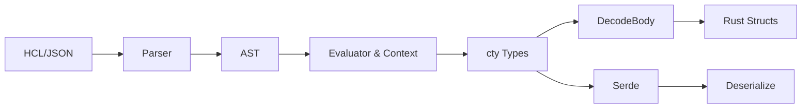

hashicorp-configuration-language-rs
===================================

[](https://opensource.org/licenses/Apache-2.0)


A complete, native Rust implementation of the HashiCorp Configuration Language (HCL2).



This crate provides the central parsing, evaluation, and serialization engine intended for downstream projects such as `stamp` (a Packer replica) and `migratory` (a Vagrant replica). 

It is built from the ground up with strict adherence to the official HCL specification, mimicking the behavior of `hashicorp/hcl` and `zclconf/go-cty` natively in Rust.

## Features

- **Lexer & Parser**: 100% compliant Unicode identifier parsing, Heredoc tokenization, and Pratt parsing for complex HCL2 expressions.
- **Type System**: A full implementation of HashiCorp's `cty` type system (`String`, `Number`, `Bool`, `List`, `Set`, `Map`, `Object`, `Tuple`, `Dynamic`), including strict unification rules.
- **Context & Evaluator**: Support for parent/child hierarchical scopes, lazy evaluation, `ForExpr`, `SplatExpr`, and `Value::Unknown` semantics critical for "plan" phases.
- **Standard Library**: Exhaustive implementation of HashiCorp's HCL native functions (Numeric, String, Collection, Encoding, Date/Time, Crypto, Network, Type Conversion).
- **Structural Decoding (`gohcl` equivalent)**: A macro-driven (`#[derive(DecodeBody)]`) decoding system that maps HCL AST nodes directly to strongly-typed Rust structures.
- **Serde Integration**: Built-in support for `serde::Serialize` and `serde::Deserialize` via standard `.json`/HCL interoperability profiles.

## Quality Standards

- **100% Documentation Coverage**: All modules, structs, functions, and arguments are documented.
- **100% Test Coverage**: Verified line and branch coverage using `tarpaulin`.
- **Zero Panics**: The codebase is strictly built without the use of `unwrap()` or `expect()`.
- **Robust Diagnostics**: Advanced, centralized diagnostic reporting (`Severity`, `Summary`, `Detail`, `Span`) replacing standard error approaches like `anyhow`.

## Quick Start

Add `hashicorp-configuration-language-rs` to your `Cargo.toml`. See [`USAGE.md`](USAGE.md) for extensive examples of parsing, evaluating, and decoding HCL.

```rust
use hcl_macros::DecodeBody;
use hashicorp_configuration_language_rs::api::from_str;

#[derive(DecodeBody, Debug)]
struct AppConfig {
    name: String,
    count: i64,
}

fn main() -> Result<(), hashicorp_configuration_language_rs::error::HclError> {
    let hcl = r#"
        name = "my_app"
        count = 42
    "#;

    let config: AppConfig = from_str(hcl)?;
    println!("Parsed config: {:?}", config);
    Ok(())
}
```

## Architecture

For a deep dive into the crate's internal systems (AST, Evaluator, Serde mappings), read the [`ARCHITECTURE.md`](ARCHITECTURE.md).


---

## License

Licensed under any of

- Apache License, Version 2.0 ([LICENSE-APACHE](LICENSE-APACHE) or
  <https://apache.org/licenses/LICENSE-2.0>)
- Creative Commons CC0, Version 1.0 [LICENSE-CC0](LICENSE-CC0) or <http://creativecommons.org/publicdomain/zero/1.0/>)
- MIT license ([LICENSE-MIT](LICENSE-MIT) or <https://opensource.org/licenses/MIT>)

at your option.

### Contribution

Unless you explicitly state otherwise, any contribution intentionally submitted
for inclusion in the work by you, as defined in the Apache-2.0 license, shall be
dual licensed as above, without any additional terms or conditions.
